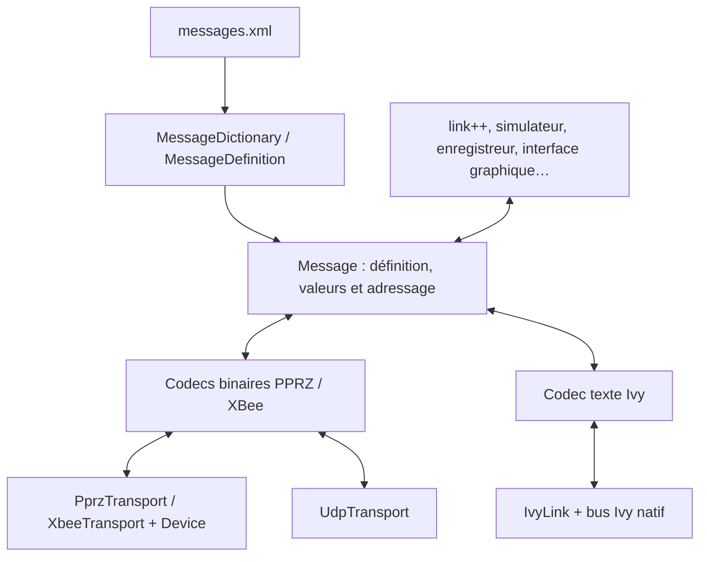
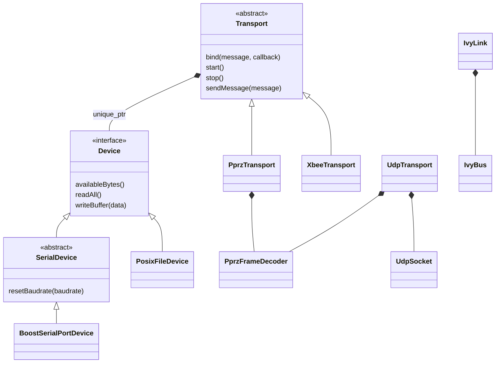

# Architecture de pprzlink++ et de link++

Ce document décrit l'implémentation présente au 30 septembre 2026. Les
adaptations proposées à la fin sont distinguées des API
déjà disponibles. La cible reste C++23 compilable avec GCC 13 sur Ubuntu 24.04.

Les réponses aux questions principales sont les suivantes :

- L'indépendance des entrées/sorties repose sur une interface `Device`, une
  classe abstraite `Transport` et des codecs utilisables sans périphérique.
  UDP et Ivy ont toutefois leurs propres classes, hors de cette hiérarchie.
- Le XML décrit déjà le contenu des messages : identifiants, noms, ordre et
  types des champs, ainsi que certaines informations documentaires.
- Un callback Ivy reçoit déjà **un message complet avec tous ses champs**.
  Les transports binaires distribuent le même contenu par `bind()` sur leur boucle Asio.
- L'envoi utilise déjà **un seul appel pour le message complet**. Son
  remplissage accepte plusieurs couples clé/valeur dans `setField()`.
  La bibliothèque C++ ne génère pas encore de structure propre à chaque message.

## 1. Bibliothèque et application : deux responsabilités

`pprzlink++` est la bibliothèque réutilisable. Elle connaît les définitions des
messages, leurs valeurs, les encodages et les mécanismes de communication.
Elle peut servir à un simulateur, un enregistreur, une interface graphique,
un outil de test, une passerelle ou un programme qui échange directement avec
un avion.

`link++`, dans [`apps/link`](apps/link), est une application de cette
bibliothèque. Elle porte les règles de la station sol : options de lancement,
association entre avions et liaisons, routage des commandes Ivy, PING/PONG,
rapports de liaison, délais et politique de retransmission XBee. Ces règles
ne sont pas nécessaires à tous les utilisateurs de la bibliothèque.



Les codecs font la conversion des données. Les périphériques et les classes
de communication font les I/O. L'application décide quoi envoyer, à qui et à
quel moment.

## 2. Le XML est bien la description des messages

### Où se trouvent les définitions ?

Le catalogue source est
[`message_definitions/v1.0/messages.xml`](../../../message_definitions/v1.0/messages.xml).
Le `v1.0` de ce chemin désigne la version du catalogue de définitions ; cela
n'empêche pas son utilisation avec le protocole PPRZLINK v2 et la bibliothèque
située dans `lib/v2.0/C++`.

Deux fichiers décrivent la syntaxe de ce XML :

- [`messages.dtd`](../../../message_definitions/v1.0/messages.dtd) ;
- [`pprz_schema.xsd`](../../../message_definitions/v1.0/pprz_schema.xsd).

Le XML donne les définitions concrètes, tandis que la DTD et le XSD décrivent
les éléments et attributs autorisés pour les écrire. Le chargeur C++ utilise
TinyXML2 et ses propres contrôles ; il ne lance pas automatiquement une
validation DTD ou XSD.

Une application fournit le fichier voulu à `MessageDictionary`. Pour `link++`,
la recherche utilise `$PPRZLINK_DIR/messages.xml`, sinon
`$PAPARAZZI_HOME/var/messages.xml`, sinon `/usr/share/pprzlink/messages.xml`.
Le fichier effectivement chargé peut donc être celui préparé pour une
configuration Paparazzi, plutôt que le catalogue source du dépôt.

### Exemple réel : SETTING

Voici une définition du catalogue, replacée dans un document minimal :

```xml
<protocol>
  <msg_class name="datalink" id="2">
    <message name="SETTING" id="4" link="forwarded">
      <field name="index" type="uint8"/>
      <field name="ac_id" type="uint8"/>
      <field name="value" type="float"/>
    </message>
  </msg_class>
</protocol>
```

Cette définition suffit pour savoir que `SETTING` appartient à la classe 2,
porte l'identifiant 4 et contient, dans cet ordre, deux entiers non signés de
8 bits puis un flottant de 32 bits. `link="forwarded"` est une indication
de routage utilisée par l'application `link++`.

Le vocabulaire des champs comprend `char`, les entiers signés et non signés
de 8, 16, 32 et 64 bits, `float`, `double` et `string`. Les tableaux utilisent
par exemple `float[3]` pour une taille fixe ou `uint8[]` pour une taille variable.
Les limites de longueur et de taille de trame dépendent aussi de l'encodage et
du transport. Les tableaux de chaînes ne sont pas pris en charge par le codec
binaire actuel.

### Structure et documentation du contenu

Le XML contient aussi du texte explicatif : un élément `<description>` pour
certains messages et du texte à l'intérieur des éléments `<field>` pour
certains champs. Les descriptions sont facultatives et ne sont donc pas
présentes partout. `WIND_INFO`, par exemple, documente les bits de son champ
`flags` ; `MOVE_WP` décrit des coordonnées avec unités et coefficients.

| Information dans le XML | Utilisation actuelle par la bibliothèque C++ |
| --- | --- |
| Nom et identifiant de classe et de message | Chargés dans le dictionnaire et les définitions. |
| Nom, type et ordre des champs | Chargés ; servent aux lectures, écritures et codecs. |
| `link="forwarded"` ou `"broadcasted"` | Exposé par `MessageDefinition::getLinkMode()` ; la politique reste dans `link++`. |
| `format`, par exemple `"%.1f"` | Exposé par `MessageField::getFormat()` ; utilisé notamment par le formatage de compatibilité OCaml. |
| `<description>` et texte explicatif d'un champ | Présents dans le fichier lorsqu'ils sont renseignés, mais non conservés dans les objets C++ actuels. |
| `unit`, `alt_unit`, `alt_unit_coef` | Conservés dans `MessageField` et exposés par leurs getters. Les appels SI explicites convertissent les grandeurs par conversion affine. |
| `values`, pour les libellés de valeurs | Non exposé comme une énumération C++ et non utilisé pour restreindre les valeurs du champ. |

Ainsi, une interface graphique peut découvrir les noms, types, unités XML,
coefficients explicites et unités SI des champs. Les descriptions textuelles
et listes de valeurs nommées demanderaient encore d'enrichir le chargement.

### Accès explicite aux grandeurs SI

`Message::getFieldDefinition()` donne directement accès à `MessageField`,
même avant que sa valeur soit renseignée. `getUnit()`, `getAltUnit()` et
`getAltUnitCoef()` conservent les métadonnées originales ; `getSIUnit()` et
`canConvertSI()` décrivent la conversion préparée.

`getFieldSI()` retourne un `double` en unités SI cohérentes ; `setFieldSI()`
reçoit un `double`, convertit vers l'unité XML et stocke le type déclaré.
L'arrondi entier est toujours au plus proche, avec les demi-valeurs en
s'éloignant de zéro. Les conversions natives gardent leur contrat.
Les tableaux numériques homogènes ont une entrée `span<const double>` et
une sortie `vector<double>&`, validées entièrement avant remplacement.
`MessageField::fromSI<T>()` et `toSI(T)` permettent une conversion isolée
d'un scalaire ou d'un élément, avec le type numérique exact du XML.

Les conversions affines immuables sont partagées par les copies de définitions.
[UnitAliases.cpp](pprzlink/UnitAliases.cpp) décrit l'unité SI canonique, la pente,
l'offset et les sélecteurs message/champ. Un résolveur borné reconnaît les
préfixes usuels sur des bases explicitement marquées, avec le bon exposant
pour surfaces/volumes. Les unités composites et encodages spéciaux sont des
entrées explicites ; aucun parseur algébrique général n'est utilisé.

Les déclarations inconnues ou dimensions contradictoires provoquent
`bad_message_file` pendant le chargement XML, y compris sur les champs texte
et unités alternatives inutilisées. Les libellés opaques connus restent
accessibles nativement. Un coefficient XML explicite multiplie la pente de
l'alternative, sans toucher à son offset ; les conversions SI indisponibles
lèvent `field_unit_error` à l'accès.

Les codecs et le relais `link++` échangent toujours les types/valeurs XML.
La conversion d'unité ne transforme ni repère, ni référence d'altitude, ni
epoch. L'ajout de métadonnées modifie la disposition des classes C++ : les
clients doivent être recompilés avec la bibliothèque. Voir le
[guide d'utilisation](guide_d_utilisation.md#convertir-explicitement-les-unités).

### Comparaison avec DSDL et Protobuf

La comparaison est juste pour le **rôle de description des données** : une
définition indépendante du langage décrit les champs à échanger. DSDL permet
de générer du code de sérialisation/désérialisation ; la chaîne Protobuf génère
des classes à partir des fichiers `.proto`. Voir la
[spécification DSDL d'UAVCAN v0](https://legacy.uavcan.org/Specification/3._Data_structure_description_language/)
et la [présentation officielle de Protobuf](https://protobuf.dev/overview/).

La bibliothèque C++ actuelle suit un autre mode d'utilisation de cette
description : elle charge le XML **à l'exécution** et manipule un type générique
`Message`. Charger une nouvelle définition ne demande donc pas de générer ni
de recompiler une classe C++ pour un outil qui traite les messages génériquement.
En contrepartie, les noms des champs et leurs types sont vérifiés à l'exécution.

Le dépôt possède déjà un
[générateur de code C](../../../tools/generator/gen_messages.py), avec les
sorties `C` et `C_standalone`. Le
[générateur C v2](../../../tools/generator/gen_messages_v2_0_c.py) produit
notamment des fonctions `pprzlink_msg_v2_send_<MESSAGE>` prenant les champs du
message comme paramètres. Cette API C, utilisable depuis C++, est distincte
de l'API de la bibliothèque `pprzlink++` décrite ici. Il n'existe pas encore de
générateur équivalent de structures et d'adaptateurs pour cette API C++.

Enfin, le format binaire PPRZLINK n'est pas celui de Protobuf. PPRZLINK encode
les champs dans l'ordre du XML, sans leurs noms ni une étiquette numérotée
devant chaque champ. Protobuf encode des numéros de champs et des catégories
d'encodage, ce qui permet notamment d'ignorer des champs inconnus. Voir sa
[description du format binaire](https://protobuf.dev/programming-guides/encoding/).

Les correspondants PPRZLINK doivent disposer de définitions compatibles. Le
message transmis ne contient pas son schéma XML et la bibliothèque ne négocie
pas ce schéma. Modifier l'ordre ou le type des champs sous les mêmes
identifiants peut casser la compatibilité, voire produire des valeurs
incorrectes sans erreur de décodage lorsque les tailles restent compatibles.

## 3. De la définition à une valeur de message

| Type public | Rôle |
| --- | --- |
| [`MessageDictionary`](pprzlink/MessageDictionary.h) | Possède les définitions ; recherche par nom ou par couple classe/identifiant. |
| [`MessageDefinition`](pprzlink/MessageDefinition.h) | Décrit un message et la liste ordonnée de ses champs. |
| [`MessageField`](pprzlink/MessageField.h) / [`FieldType`](pprzlink/MessageFieldTypes.h) | Décrivent un champ : nom, type, tableau éventuel, format et unités/conversion SI. |
| [`FieldValue`](pprzlink/FieldValue.h) | Contient la valeur d'un champ, scalaire ou tableau, dans un `std::variant`. |
| [`Message`](pprzlink/Message.h) | Possède une copie de sa définition, ses valeurs et ses identifiants d'expéditeur/destinataire/composant. |
| [`ReceivedMessage`](pprzlink/ReceivedMessage.h) | Possède un `Message` reçu et les métadonnées de sa réception. |

Construire `Message(dictionary.getDefinition("SETTING"))` crée un message dont
la structure est connue mais dont les champs n'ont pas encore de valeur.
`setField()` les remplit. Un message complet décodé contient déjà toutes ces
valeurs ; il n'est pas nécessaire de demander leur réception séparément.

`getField<float>("value")` exige exactement le type C++ correspondant au champ.
`getFieldAs<double>("value")` demande explicitement une conversion numérique.
`setField()` vérifie les conversions et refuse par exemple 300 pour un `uint8`
ou une valeur fractionnaire pour un entier. Une conversion vers un flottant
peut néanmoins arrondir. Voir les contrats détaillés dans
[`API_USAGE.md`](API_USAGE.md).

Un programme générique peut parcourir `message.getDefinition().getNbFields()`,
obtenir chaque définition avec `getField(i)` et lire sa valeur par
`message.getRawValue(i)` ou `message.getField(i)`. `message.toString()` fournit
déjà un affichage de l'ensemble des champs avec leurs noms.

L'expéditeur, le destinataire et le composant de l'en-tête binaire sont distincts
des champs déclarés dans le XML. En particulier, `setReceiverId(42)` ne remplit
pas un champ `ac_id`, et `setField("ac_id", 42)` ne change pas cet en-tête.
Leur correspondance éventuelle relève du message et de l'application.

## 4. Indépendance du transport : héritage et composition

### Les deux abstractions existantes



[`Device`](pprzlink/Device.h) est une interface abstraite de **flux d'octets**.
Elle ne connaît ni les messages XML ni les avions. `readAll()` consomme les
octets disponibles ; `writeBuffer()` doit écrire tout le buffer ou signaler
une erreur. Une erreur d'I/O peut survenir après l'écriture d'une partie des
octets : il ne s'agit pas d'une transaction annulable.

`SerialDevice` ajoute la possibilité de changer le débit UART, utile pour
l'initialisation d'un modem. `BoostSerialPortDevice` fournit l'implémentation
avec Boost.Asio. `PosixFileDevice` fournit l'adaptation pour un descripteur de
fichier ou de FIFO.

[`Transport`](pprzlink/Transport.h) est une classe abstraite au niveau des
**messages**. Elle possède son périphérique via `std::unique_ptr<Device>` et
emprunte le dictionnaire. Elle déclare les opérations virtuelles d'envoi et de
réception événementielle. `bind()` conserve les abonnements ; `start()` active
les lectures et `stop()` les annule. Les méthodes de réception par polling ont été retirées.

`PprzTransport` ajoute l'enveloppe PPRZ au message binaire. `XbeeTransport`
transporte le message dans les trames API du modem XBee, traite les adresses
radio et les statuts du modem. Ils sont interchangeables via un
`Transport&` ou un `std::unique_ptr<Transport>` pour les opérations communes.
Les opérations spécifiques à XBee restent accessibles sur `XbeeTransport`.

### UDP et Ivy ne dérivent pas de Transport

[`UdpTransport`](pprzlink/UdpTransport.h) possède un socket UDP et utilise le
même `PprzFrameDecoder` que le transport PPRZ. Il retourne également un
`ReceivedMessage`, mais chaque envoi exige une destination réseau explicite :
`sendMessage(message, destination)`.

Il conserve l'adresse source du datagramme avec chaque message décodé. Un
datagramme peut fournir plusieurs trames ; une trame incomplète en fin de
datagramme est abandonnée, afin de ne pas assembler des morceaux provenant
de datagrammes ou de pairs différents.

[`IvyLink`](pprzlink/IvyLink.h) possède un bus Ivy natif et expose les
abonnements, publications et requêtes. Il utilise le codec texte Ivy, avec un
modèle de publication/abonnement plutôt qu'un flux binaire.

Il n'y a donc **pas de classe de base unique couvrant PPRZ, XBee, UDP et Ivy**.
La réutilisation repose sur le modèle `Message`, les codecs et, pour les
transports binaires, `ReceivedMessage`. `link++` possède actuellement des
membres distincts pour `Transport` et `UdpTransport` et raccorde leur réception
au même traitement applicatif.

### Réutiliser les codecs avec une autre bibliothèque d'I/O

[`PprzFrameCodec.h`](pprzlink/PprzFrameCodec.h) expose
`encodePprzFrame(message)`, `PprzFrameDecoder::pushBytes()` et `tryReceive()`.
Ces opérations ne font aucune I/O. Une application Qt, par exemple, pourrait
leur fournir les octets de son propre port série, puis écrire les trames
encodées avec ses propres primitives.

Pour un nouveau flux d'octets, il est aussi possible d'implémenter `Device` et
de conserver `PprzTransport`. Pour un nouveau protocole d'enveloppe sur un flux,
une nouvelle implémentation de `Transport` peut réutiliser le modèle de messages
et les codecs appropriés. Un nouveau support à datagrammes doit préserver ses
frontières et ses adresses, comme le fait UDP.

## 5. Réception : tous les champs dans un seul callback ?

### Sur Ivy : oui, sous forme d'un Message complet

La signature publique du callback est :

```cpp
using messageCallback_t = std::function<void(std::string, pprzlink::Message)>;
```

Le premier argument est l'expéditeur, le second le message décodé avec tous ses
champs. Exemple de fonction qui reçoit un `SETTING`, affiche ses trois champs
puis arrête sa boucle :

```cpp
#include <pprzlink/IvyLink.h>
#include <cstdint>
#include <iostream>
#include <string>

void receiveOneSetting(const std::string& messagesPath)
{
    pprzlink::MessageDictionary dictionary(messagesPath);
    pprzlink::IvyLink link(dictionary, "settings-monitor");

    auto subscription = link.subscribeMessage("SETTING",
        [&link](std::string sender, pprzlink::Message message) {
            const auto index = message.getField<std::uint8_t>("index");
            const auto aircraft = message.getField<std::uint8_t>("ac_id");
            const auto value = message.getField<float>("value");

            std::cout << sender << ": aircraft=" << static_cast<unsigned>(aircraft)
                      << " index=" << static_cast<unsigned>(index)
                      << " value=" << value << '\n';
            link.stop();
        });

    link.run(); // Attend le message ; cet exemple ne fixe pas de délai.
}
```

Les trois `getField()` lisent un objet déjà décodé. Ils ne déclenchent aucun
échange supplémentaire. Le décodage de tous les champs précède le callback ;
un message mal formé ne lui est pas fourni partiellement.

La variable `subscription` possède directement un `ivy::Subscription` de la
bibliothèque Ivy C++. Il faut la conserver : sa destruction désabonne.
L'appelant n'a pas à gérer un identifiant numérique ni à écrire une expression
régulière. La connaissance du XML et la construction du `Message` sont les
services ajoutés par pprzlink++ au-dessus d'Ivy.

`subscribeSender()` permet de recevoir les messages d'un expéditeur.
`sendRequest()` et `subscribeRequestAnswerer()` traitent les échanges Ivy
requête/réponse ; leurs callbacks reçoivent également des messages complets.
Les requêtes sont reconnues par le suffixe `_REQ` et utilisent `sendRequest()`
au lieu de `sendMessage()`.

### Sur série, XBee et UDP : des abonnements sur le contexte Asio

```cpp
transport.bind(pprzlink::ALL,
    [](const pprzlink::Message &message, const pprzlink::ReceiveInfo &info) {
        // Le message et les métadonnées appartiennent à cette invocation.
        std::cout << message.toString() << '\n';
    });
transport.start();
context.run();
```

`MemoryDevice` fournit le même flux événementiel en mémoire : ses écritures
sont bouclées en entrée et `feed()` peut injecter des octets pour les simulations.
Le callback de lecture alimente le décodeur, puis les abonnements correspondants.
UDP utilise `async_receive_from()` ; les flux série et POSIX notifient le transport
après avoir reçu les octets. Les callbacks applicatifs s'exécutent hors des verrous
d'I/O, dans le contexte fourni, et sont sérialisés par récepteur. Aucun thread
supplémentaire n'interroge les canaux. Les gardes et réponses AT XBee utilisent
des échéances Asio, indépendamment de l'arrivée de messages applicatifs.

`ReceiveInfo` contient la taille complète de trame et les métadonnées UDP/XBee
lorsqu'elles existent. Ses références et celles du message sont valables pendant
le callback. Les vues `span`/`string_view` héritent de cette durée de vie : copiez
le message pour le conserver et créez de nouvelles vues sur la copie.

Le récepteur conserve les bindings. Les filtres supplémentaires utilisent
`ReceiveFilter` et se combinent avec ET : émetteur, destinataire, classe, composant,
origine UDP, origine radio/RSSI et prédicat sur les champs. Voir le
[contrat détaillé](API_USAGE.md#réception-réactive--abonnements-et-filtres).

`XbeeTransport::setStatusCallback()` observe les statuts radio, modem et AT.
Ils sont distribués dès leur décodage, même si aucun message PPRZLINK ne correspond
à un abonnement. `onReady()` observe la fin du dialogue d'initialisation.

## 6. Envoi : tous les champs dans un seul appel ?

Oui pour **envoyer un Message déjà rempli**. Voici une fonction applicative
utilisant exclusivement l'API disponible :

```cpp
#include <pprzlink/IvyLink.h>

void publishSetting(pprzlink::IvyLink& link,
                    const pprzlink::MessageDictionary& dictionary)
{
    pprzlink::Message message(dictionary.getDefinition("SETTING"));
    message.setSenderId(0);
    message.setReceiverId(42);
    link.sendMessage(message.setField("index", 7, "ac_id", 42, "value", 12.5f));
}
```

`setField()` accepte un ou plusieurs couples nom/valeur. L'appel à deux
arguments reste disponible ; un nombre impair d'arguments est refusé à la
compilation. Les valeurs sont contrôlées selon le XML, avec le même contrat
pour les scalaires, chaînes et tableaux.

Les deux surcharges renvoient une référence `const Message&` sur le message
modifié, sans copie. Cela permet l'appel imbriqué montré ci-dessus, ou
`link.sendMessage(message.setField("value", 12.5f))` lorsque les autres champs
sont déjà renseignés. Une exception pendant `setField()` empêche l'appel à
`sendMessage()`. La référence retournée reste liée à la durée de vie du message.

Les contraintes `EvenNumberOfFieldArguments` et `FieldNamesAreStrings`
expliquent les erreurs d'arité et les clés de mauvais type dans la partie
variadique. La première clé est contrôlée par son paramètre `const std::string&`.
GCC indique la ligne de l'appel fautif, même pour une mauvaise clé en fin de
liste. Les noms de champs inconnus et les incompatibilités avec le XML restent
vérifiés à l'exécution, puisque les définitions y sont chargées.

Les couples sont appliqués de gauche à droite, comme des appels séparés. Si
un champ est invalide, les couples précédents restent appliqués ; ce champ et
les suivants ne sont pas modifiés. Un nom répété prend la dernière valeur.

Les appels `setField()` modifient seulement l'objet local. L'unique
`sendMessage()` publie tous les champs ensemble, dans l'ordre de leur définition
XML, quel que soit l'ordre des appels `setField()`.

| Liaison | Appel sur le message préparé |
| --- | --- |
| PPRZ ou XBee via `Transport` | `transport.sendMessage(message)` |
| UDP | `udp.sendMessage(message, pprzlink::UdpEndpoint{"127.0.0.1", 4242})` |
| Ivy | `link.sendMessage(message)` |

Chaque encodage construit un message complet avant son envoi. Un champ
obligatoire non renseigné provoque une erreur ; les valeurs absentes ne sont
pas remplacées silencieusement par zéro. Les tableaux sont également fournis
comme une valeur de champ complète, puis encodés avec le reste du message.

L'enveloppe diffère selon la liaison :

- PPRZ transporte un en-tête binaire et les champs dans une trame PPRZ avec
  longueur et sommes de contrôle ; UDP utilise ces mêmes trames.
- XBee transporte l'en-tête et les champs PPRZLINK dans une trame API XBee,
  avec ses propres adresses et statuts radio.
- Ivy transporte une forme textuelle du type `0 SETTING 7 42 12.5` ; il ne
  transporte pas l'en-tête binaire complet. Le `receiverId` renseigné ci-dessus
  n'est donc pas publié comme un destinataire Ivy. Pour cette commande,
  `link++` utilise le champ `ac_id` et la règle `forwarded` pour son routage.

Réussir l'appel d'envoi ne prouve pas que l'avion a reçu ou appliqué la commande.
Les statuts XBee et les réponses applicatives correspondent à d'autres étapes.

La surcharge de `setField()` est générique : elle prend les noms et valeurs
des champs. Il n'existe pas encore de fonction propre à `SETTING` prenant
seulement `index`, `ac_id` et `value`, ni de callback qui les fournisse
automatiquement comme trois paramètres typés. Le point d'entrée commun reste
`Message`, avec accès par champ.

## 7. Une couche typée serait une amélioration possible

Pour un programme qui connaît ses messages à la compilation, une structure
nommée serait plus facile à utiliser :

```cpp
#include <cstdint>

// Exemple de type applicatif possible, absent de la bibliothèque actuelle.
struct Setting {
    std::uint8_t index;
    std::uint8_t acId;
    float value;
};
```

Un adaptateur pourrait convertir le `Message` reçu en `Setting`, puis appeler
le callback de l'application avec cette structure complète. Dans l'autre sens,
une fonction prenant un `Setting` pourrait effectuer les trois `setField()`
et appeler `sendMessage()`. L'utilisateur de cet adaptateur fournirait tous
les champs avec `Setting{.index = 7, .acId = 42, .value = 12.5f}`.

Il est possible d'écrire ces adaptateurs à la main aujourd'hui. Leur génération
à partir du XML éviterait ensuite de recopier les noms et types des champs.
Le travail porterait sur un générateur C++ et une couche d'API au-dessus du
modèle existant ; il ne demanderait pas de remplacer le XML ni le protocole.

Une progression raisonnable serait :

1. Écrire un adaptateur pour un petit message scalaire, puis un message à
   tableaux, afin d'évaluer les appels de réception et d'envoi dans de vrais
   clients.
2. Garder les champs dans une structure lisible avec des noms explicites,
   plutôt qu'imposer de longues listes de paramètres positionnels.
3. Séparer cette structure de données de l'adressage et des métadonnées de
   transport ; un `ac_id` dans le contenu n'est pas toujours une destination.
4. Une fois l'usage satisfaisant, générer structures et conversions depuis le
   XML, avec contrôle de cohérence entre les définitions utilisées à la
   génération et celles chargées à l'exécution.

Cette couche serait facultative. L'API dynamique resterait utile à `link++`,
aux inspecteurs de messages et aux enregistreurs qui doivent accepter des
définitions inconnues à la compilation. La conception devrait conserver la
compatibilité GCC 13 et des types simples à comprendre ; une réflexion C++
native des champs n'est pas disponible en C++23.

## 8. Durées de vie, boucles et erreurs

Le dictionnaire doit vivre plus longtemps que les liens, transports ou
décodeurs qui l'empruntent. Un `Message`, lui, possède sa définition et ses
valeurs : le conserver ne revient pas à conserver une vue sur un buffer de
réception réutilisé.

Un `Transport` possède son `Device`. Un `UdpTransport` possède son socket.
Les objets utilisant un `boost::asio::io_context` fourni par l'application
exigent que ce contexte leur survive. Le port série effectue ses réceptions
asynchrones grâce à cette boucle ; UDP utilise également des lectures asynchrones
et distribue les messages depuis leurs callbacks de fin de réception.

Les appels sur un même transport doivent être sérialisés par l'application.
`IvyLink` autorise les envois et opérations d'abonnement depuis plusieurs
threads, mais les callbacks s'exécutent sur la boucle Ivy. Par défaut,
`run()` fait tourner cette boucle sur le thread appelant ; le constructeur
peut aussi demander un thread possédé par `IvyLink`.

Un désabonnement n'attend pas la fin d'un callback déjà commencé. Les objets
capturés doivent donc rester vivants jusqu'à la fin de son exécution.
`stop()` peut être appelé depuis un callback ; la destruction du lien doit
avoir lieu en dehors de ce callback et après la fin des appels externes.
Une interface graphique doit transférer les données vers son propre thread
avant de modifier ses widgets.

L'absence de message est représentée par `std::nullopt`. Les erreurs de
définition, de valeur, de décodage ou d'I/O utilisent des exceptions. Une
trame au contenu mal formé peut être consommée avant que l'erreur soit
signalée ; l'appel suivant peut poursuivre le décodage. Les erreurs de
callback Ivy suivent le mécanisme du bus natif, accessible par `getBus()` ;
`IvyLink::run()` vérifie aussi ces erreurs au retour de la boucle.

## 9. Composants et points d'entrée pour une autre application

| Cible CMake | Contenu et usage |
| --- | --- |
| `pprzlink::core` | Dictionnaire, messages, conversions SI affines, codecs, abstractions et transports sur `Device`. Permet le décodage hors ligne ou l'intégration à ses propres I/O, sans bus Ivy. |
| `pprzlink::io` | Ajoute série Boost.Asio, UDP et périphérique POSIX ; dépend de `core`. |
| `pprzlink::ivy` | Ajoute `IvyLink` et la dépendance Ivy native ; dépend de `core`. |
| `pprzlink++`, `pprzlink++_static` | Cibles historiques regroupant les composants construits. |

Le codec de **texte** Ivy appartient au cœur et peut être utilisé sans démarrer
de bus. La dépendance à la bibliothèque Ivy est apportée par le composant
`ivy`. Un consommateur peut sélectionner `COMPONENTS core`, `io` ou `ivy` avec
`find_package(pprzlink++ CONFIG REQUIRED ...)` ; `core` et `io` ne recherchent
pas Ivy. La construction sans Ivy est également disponible.

Les exemples exécutables à relire pour évaluer l'API sont :

- [`IvyReceiver.cpp`](pprzlink/examples/clients/IvyReceiver.cpp) pour l'abonnement
  et les lectures de champs ;
- [`SerialAircraft.cpp`](pprzlink/examples/clients/SerialAircraft.cpp) pour
  simuler un avion et répondre à PING ;
- [`UdpRecorder.cpp`](pprzlink/examples/clients/UdpRecorder.cpp) pour enregistrer
  les messages avec leur origine réseau ;
- [`UdpSettingSender.cpp`](pprzlink/examples/clients/UdpSettingSender.cpp) pour
  renseigner tous les champs d'une commande dans un seul `setField()` et envoyer
  son datagramme à un pair de test local.

Les instructions de compilation et d'utilisation se trouvent dans
[`README.md`](README.md) et [`API_USAGE.md`](API_USAGE.md). Les contraintes de
remplacement de l'application OCaml sont suivies dans
[`LINK_CPP_PLAN.md`](LINK_CPP_PLAN.md), les comparaisons dans
[`LINK_CPP_VALIDATION.md`](LINK_CPP_VALIDATION.md), et la validation de la
plateforme minimale dans
[`VALIDATION_UBUNTU24_GCC13.md`](VALIDATION_UBUNTU24_GCC13.md).
